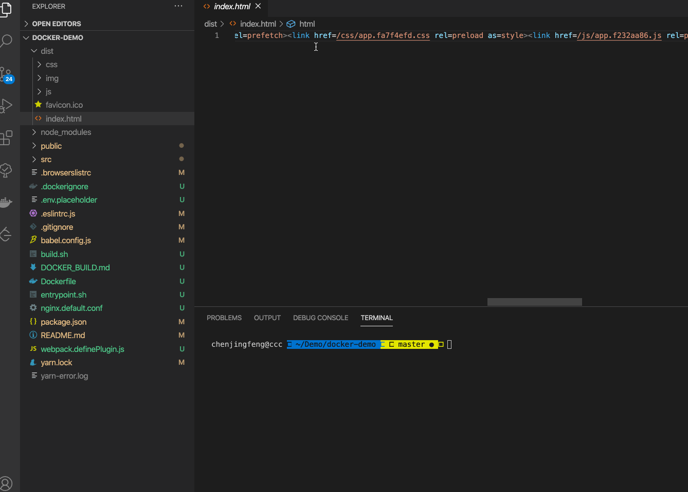
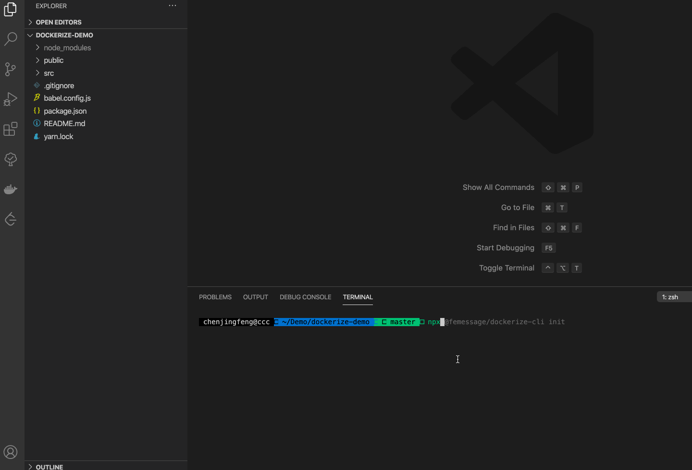

# 🐳 dockerize-cli

[](https://www.npmjs.com/package/@femessage/dockerize-cli)
[](https://www.npmjs.com/package/@femessage/dockerize-cli)
[](https://github.com/femessage/dockerize-cli/blob/master/LICENSE)
[](https://github.com/femessage/dockerize-cli/pulls)

🔨 前端项目 docker 化利器，帮助你快速的把前端项目打造通过环境变量启动的镜像。

## 目录

- [注意事项](#注意事项)
  - [环境需求](#环境需求)
- [使用教程](#使用教程)
  - [快速开始](#快速开始)
  - [参数选项](#参数选项)
- [Links](#links)

## 注意事项

### 环境需求

Node.js 8.x

### replace 问题

replace 是通过下载代码中的 url 连接到本地，然后替换这个 url 为本地文件引用来完成替换的。

下载默认会使用 https 协议，如果下载源的 https 证书过期的话，node 会在 SSL 检查的时候帮我们把链接断开。

此时需要在项目根目录增加 dockerize.config.js 配置文件

例子

```js
module.exports = {
  linkesFilter(links, ignores) {
    const ignoreArray = ignores.concat([/https?:\/\/img.t.sinajs.cn/])

    return [...new Set(links)].filter((link) => {
      return !ignoreArray.some((regexp) => regexp.test(link))
    })
  },
  rejectUnauthorized: false, // 容许 https 证书无效
}
```

## 使用教程

### 快速开始

```shell
# 在项目根目录执行

# 如果本来项目已经包含了 init 的文件，请参照自己需求修改或者删除自己原本的文件改造

npx @femessage/dockerize-cli init
```

### 参数选项

`npx @femessage/dockerize-cli replace [dist][public_path]`

1. dist 为目录名
2. public_path 为上下文地址，默认不填写是 /

把对应的前端构建产物里面的所有网络链接下载到本地，然后替换掉原本的网络链接，使其变成本地静态资源。

ps: 一般私有化部署前端项目，客户环境又不能访问外网的时候有用。



[⬆ Back to Top](#目录)

```shell
npx @femessage/dockerize-cli proxy
```

启动一个静态资源服务器，并且对对应接口提供代理服务，以解决跨域测试 dist 文件的问题

需要配合项目根目录的 dockerize.config.js 启动

在你的根目录创建 dockerize.config.js 文件。

```js
const API_SERVER = 'http:/www.deepexi.api/'

module.exports = {
  // 需要代理的接口
  proxy: {
    '/api': {
      target: API_SERVER,
      changeOrigin: true,
    },
    '/asset-service': API_SERVER,
    '/identity-service': API_SERVER,
    '/openapi': API_SERVER,
    '/cooperation-service': API_SERVER,
  },
  // 静态资源目录
  staticPath: 'dist',
  // 静态资源服务器的端口号
  proxyPort: 9000,
}
```

[⬆ Back to Top](#目录)

```shell
npx @femessage/dockerize-cli init
```

快速添加 docker 所需相关文件，以及 npm script 到你的项目中



具体文件以及 npm script 使用方法可以查看 init 之后，在项目根目录生成的 DOCKER_BUILD.md

[⬆ Back to Top](#目录)

## Links
- [设计文档](https://www.yuque.com/ubdme4/ccc/mto2nz#BAbmJ)

## Contributors

Thanks goes to these wonderful people ([emoji key](https://allcontributors.org/docs/en/emoji-key)):

<!-- ALL-CONTRIBUTORS-LIST:START - Do not remove or modify this section -->
<!-- prettier-ignore -->
<table><tr><td align="center"><a href="http://www.ccc1996.cn"><br /><sub><b>cjf</b></sub></a><br /><a href="https://github.com/FEMessage/dockerize-cli/commits?author=cjfff" title="Code">💻</a> <a href="https://github.com/FEMessage/dockerize-cli/commits?author=cjfff" title="Tests">⚠️</a> <a href="#blog-cjfff" title="Blogposts">📝</a> <a href="#maintenance-cjfff" title="Maintenance">🚧</a></td><td align="center"><a href="http://dream2023.github.io"><br /><sub><b>超杰</b></sub></a><br /><a href="https://github.com/FEMessage/dockerize-cli/commits?author=dream2023" title="Code">💻</a></td><td align="center"><a href="https://blog.deepenlau.me/"><br /><sub><b>deepen</b></sub></a><br /><a href="https://github.com/FEMessage/dockerize-cli/commits?author=DeepenLau" title="Code">💻</a></td></tr></table>

<!-- ALL-CONTRIBUTORS-LIST:END -->

This project follows the [all-contributors](https://github.com/all-contributors/all-contributors) specification. Contributions of any kind welcome!
